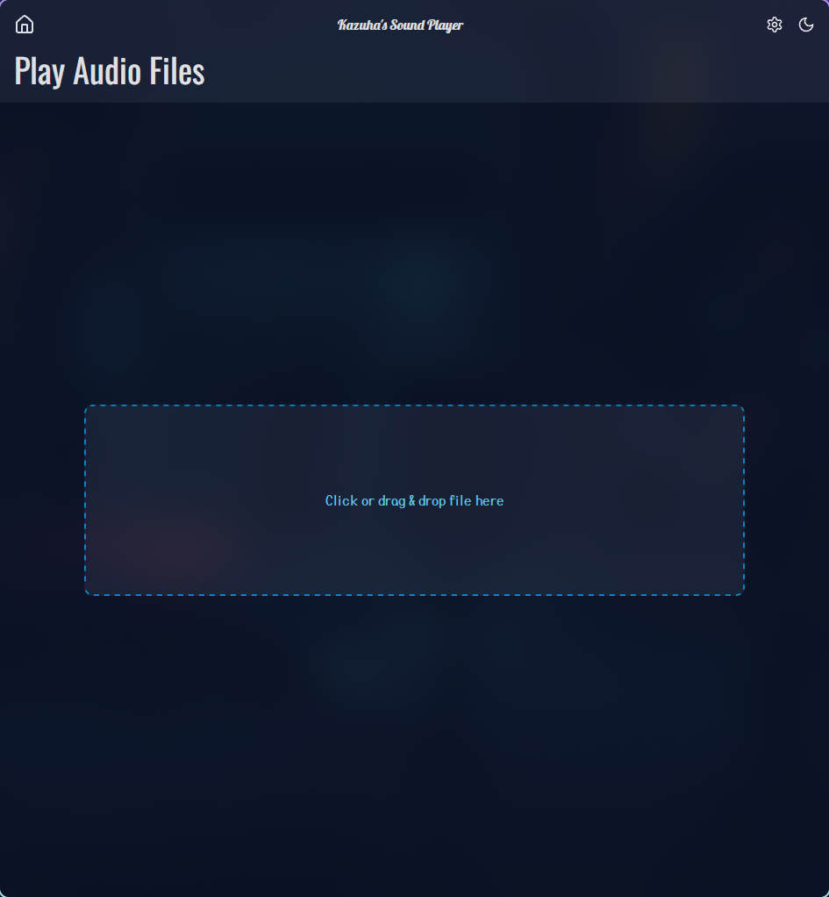
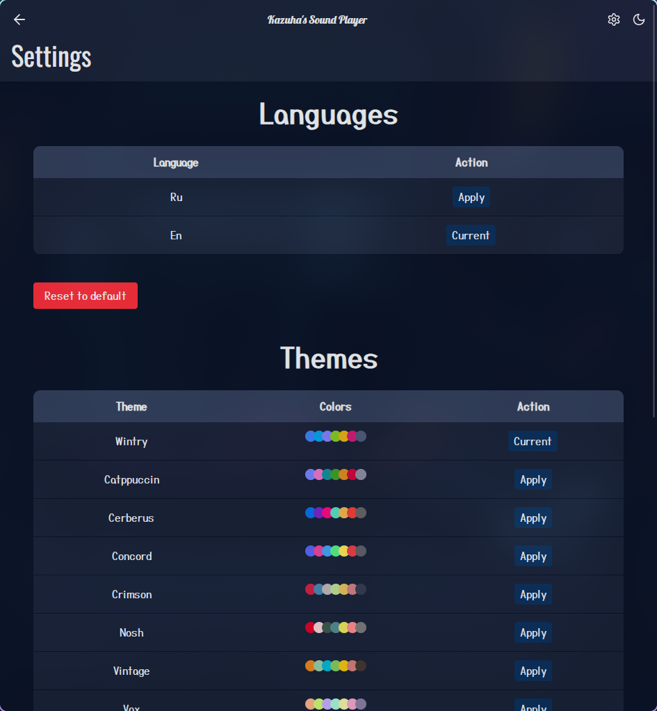

# 🎧 Sound Player

[](https://github.com/mrkirill046/sound-player)
[](https://tauri.app/)
[](https://svelte.dev/)
[](https://www.rust-lang.org/)
[](LICENSE)
[](https://github.com/mrkirill046/sound-player/releases/latest)

> Мощный, кроссплатформенный и лёгкий музыкальный плеер, построенный на **Rust**, **Tauri**, **Svelte** и **Skeleton UI**.  
> Минимализм. Скорость. Красота.

---

## 🚀 Возможности

- ⚡ **Невероятная производительность** благодаря нативному Rust + Tauri
- 🎨 **Интерфейс нового поколения** с помощью [Svelte](https://svelte.dev) + [Skeleton UI](https://www.skeleton.dev)
- 🌙 Поддержка **тёмной/светлой темы**
- 🎵 Локальное воспроизведение треков (MP3, WAV и др.)
- 📁 Drag & Drop, плейлисты, прогрессбар, горячие клавиши

---

## 🛠️ Стек технологий

| Технология     | Назначение                            |
|----------------|----------------------------------------|
| [Rust](https://www.rust-lang.org/)     | Ядро и backend логика плеера       |
| [Tauri](https://tauri.app/)           | Обёртка для кроссплатформенного GUI |
| [SvelteKit](https://kit.svelte.dev/) | Фронтенд-фреймворк нового поколения |
| [TypeScript](https://www.typescriptlang.org/) | Безопасность и типизация           |
| [Skeleton UI](https://www.skeleton.dev/) | Tailwind UI-компоненты с темами     |

---

## 📦 Установка и запуск

> Требуется: **Rust**, **Node.js**, **bun**

### 1. Установка зависимостей

```bash
bun install
````

### 2. Запуск в режиме разработки

```bash
bun tauri dev
```

### 3. Сборка проекта

```bash
bun tauri build
```

---

## 🖼️ Скриншоты

<details>
    <summary>Главное окно</summary>
    
    
</details>
<details>
    <summary>Настройки</summary>
    
</details>

---

## 📁 Структура проекта

```text
sound-player/
├── src/                  # Фронтенд: Svelte + Skeleton
│   ├── app.html
│   └── routes/           # Роуты приложения
│       ├── +layout.ts
│       └── +page.svelte

├── src-tauri/            # Backend на Rust + Tauri
│   ├── Cargo.toml
│   ├── tauri.conf.json
│   ├── src/              # Точка входа в Rust-приложение
│   │   └── main.rs
│   └── icons/            # Иконки для всех платформ

├── static/               # Статические ассеты
├── package.json          # Node.js зависимости
├── svelte.config.js      # Конфигурация SvelteKit
├── vite.config.js        # Конфигурация Vite
├── tsconfig.json         # TypeScript конфиг
└── README.md             # Документация проекта
```

---

## 🧩 Планы на будущее

- [x] Горячие клавиши и медиа-кнопки
- [x] Настройки тем
- [ ] Плагины и расширения

---

## 📄 Лицензия

MIT — делай с этим что хочешь, но не забывай об авторах. 😉

---

## 🧠 Автор

Разработка: [Кирилл aka Kazuha](https://kazuha046.qwy-games.ru)
❤️ Идея, код, дизайн, вдохновение — всё сам.

---

> *“Приложения не должны быть жирными. Они должны быть быстрыми, красивыми и дышать.”*
> — ты
